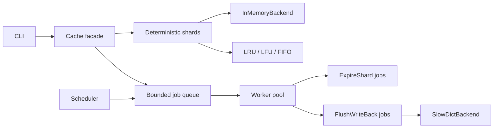

# CacheLab

CacheLab is a CLI-first Python caching library that treats a cache like a small
systems component: sharded locks, swappable eviction policies, TTL expiration,
single-flight loading, worker queues, active expiration, write-through and
write-back modes, structured stats, and deliberate unsafe examples.

**Author:** Princeton Afeez

## Quickstart

```powershell
python -m pip install -r requirements-dev.txt
cachelab put user:1 Ada --ttl 30
cachelab get user:1
cachelab stats
cachelab simulate --policy lru --pattern looping --capacity 100 --requests 10000
cachelab benchmark --policies lru,lfu,fifo --pattern hotspot --requests 50000
cachelab demo all
pytest
```

Install the library only (no dev tools): `python -m pip install -r requirements.txt`

## Library Example

```python
from cachelab import Cache

with Cache(capacity=100, policy="lfu", shard_count=4, worker_count=2, default_ttl=60) as cache:
    cache.put("session:1", {"user": "Ada"})
    value = cache.get_or_compute("profile:1", lambda: {"name": "Ada"})
    print(value)
    print(cache.stats())
```

Passing no `ttl` uses the default TTL for new entries. Passing `ttl=None`
stores an entry without expiration, which makes the default TTL override
explicit. A supplied `ttl` must be positive.

See `examples/` for runnable scripts (`basic_usage.py`, `write_back_demo.py`,
`concurrent_load.py`).

`get(key)` returns `None` on a miss, so a stored `None` value looks like a miss;
pass a sentinel `get(key, default)` (or use `contains()`/`inspect()`) to tell
them apart. `get`, `contains`, and `get_or_compute` count toward the hit/miss
ratio and apply lazy expiration; `inspect` and `dump` are diagnostics that do
neither.

## Architecture



The cache facade orchestrates public operations. Each shard owns its backend,
eviction policy, lock, single-flight registry, version markers, tombstones, and
stats counters. The cache core does not branch on policy type; `LRUPolicy`,
`LFUPolicy`, and `FIFOPolicy` share the same policy contract.

## Policies

`LRU` uses `OrderedDict` as an intentional hash map plus linked order structure:
`get` and `put` move keys to the recent end, and eviction takes the oldest key.

`LFU` keeps a key-to-frequency map plus frequency buckets. Frequency changes,
new insertions, and eviction are O(1). Ties inside one frequency bucket are
broken by recency.

`FIFO` records insertion order only. Reads do not affect eviction order, making
it a useful baseline in simulations.

## TTL

TTL is separate from capacity eviction. Lazy expiration removes stale entries
when public APIs touch them. Active expiration is handled by the scheduler,
which enqueues `ExpireShard` messages for workers. TTL correctness uses an
injected monotonic clock; tests use `FakeClock` rather than real sleeps.

A supplied `ttl` must be positive; `ttl=None` stores an entry with no expiry, and
omitting `ttl` uses the configured default. Updating a key without a `ttl`
preserves its original expiry rather than restarting the countdown.

## Concurrency

One global lock is simple, but it bottlenecks read-heavy caches because unrelated
keys block each other. CacheLab divides capacity across deterministic shards
(capacity must be at least the shard count so no shard is zero-sized). Different
keys usually hit different locks, while every check-then-act sequence inside one
shard remains atomic.

Shard routing uses a process-stable hash that canonicalizes the numeric tower,
so keys that are equal under `==` but render differently (`1`, `1.0`, `True`)
always land on the same shard and never miss each other, without depending on
Python's randomized hash seed.

`get_or_compute` uses a per-shard single-flight registry. Concurrent misses for
the same key share one loader execution; loader failures propagate to waiters
without storing partial values. If only the background write-back flush is
backpressured (not the load itself), the loaded value is still published to
waiters and cached — the durable flush is simply deferred.

## Queue And Workers

Workers consume explicit dataclass messages: `ExpireShard`, `FlushWriteBack`,
`PreloadKey`, `SnapshotStats`, and `StopWorker`. The scheduler produces
`ExpireShard`; writes produce `FlushWriteBack`; `cache.preload(key, loader)` and
`cache.request_snapshot()` produce `PreloadKey` and `SnapshotStats` (the latter
readable via `cache.last_snapshot()`). Message passing keeps maintenance work out
of request paths, exposes queue depth and retry behavior, and gives shutdown a
deterministic protocol. An unrecognized job is counted as a worker failure rather
than silently dropped.

Bounded queues demonstrate backpressure. Non-critical expiration jobs may be
dropped and counted when the queue is full. Critical write-back jobs block for a
configured timeout and raise instead of disappearing silently.

Shutdown is driven by a stop event rather than the queue, so `close()` joins
every worker and scheduler thread even when a bounded queue is saturated, and is
safe to call more than once. In write-back mode `close(flush=True)` drains
pending flushes and reports `ShutdownFlushError` if anything cannot be
persisted.

## Write Modes

`cache-only` updates only the in-memory cache.

`write-through` writes to the source-of-truth backend before returning. It is
safer and easier to reason about, but slow backends are visible in request
latency.

`write-back` updates the cache immediately, marks entries dirty, and flushes in
workers. It is faster on the request path but can lose data or persist stale
values unless versioning and tombstones are correct. CacheLab gives every key a
monotonic version. Old flush jobs are skipped when a newer write or delete has
already happened, and delete tombstones prevent stale put jobs from resurrecting
removed values.

## Configuration

Caches can be built from a declarative TOML file (see `configs/`). The CLI's
basic commands accept `--config`, which overrides `--capacity/--policy/--shards`:

```powershell
cachelab --config configs/default.toml put user:1 Ada --ttl 30
cachelab --config configs/default.toml stats
```

`CacheConfig.from_file` is also available from the library. For basic commands,
`--config` controls capacity/policy/shards/TTL; worker-dependent settings
(`worker_count`, `write_mode = "write-back"`, `active_expiration`) have no effect
there, because each basic command is a one-shot process that persists to a JSON
state file rather than starting workers or a source backend. Use the library API
(`with Cache(config=...) as cache:`) to exercise those.

Because the CLI is stateless between invocations, the `stats` command reports
only the current process; use `simulate`/`benchmark` for meaningful hit-ratio
numbers. Those commands run on a single shard by default (`--shards 1`) so the
numbers reflect the policy, not capacity split across sub-caches. Basic CLI
commands also default to `--shards 1`.

The CLI state file stores each entry's remaining TTL (`ttl_remaining`) using the
cache's monotonic clock semantics at save time. Legacy state files that used
wall-clock `expires_wall` are still loaded for backward compatibility.

`cachelab get` uses a miss sentinel so a cached `None` value prints as `None`, not
`(miss)`, with a single counted read. Use `put --no-ttl` to store without expiry
when a default TTL is configured. Plain CLI keys and values are strings; pass
`--key-json` / `--value-json` for typed JSON literals (e.g. `true`, `42`,
`'{"user":"Ada"}'`).

The state file stores a `config` block (capacity, policy, shard count, default
TTL) plus per-entry `ttl_remaining` and `hit_count`. Aggregate hit/miss counters
reset on each CLI reload (only per-entry `hit_count` is restored). A warning is
printed when reloaded settings differ from what was saved or when entries are
evicted because capacity shrank.

`cachelab --version` prints the installed version. The CLI uses conventional exit
codes: **0** on success, **1** on a runtime error (printed as `cachelab: error: ...`),
and **2** on a usage error (invalid arguments, from argparse).

## Security

CacheLab is an in-process library and single-user CLI, not a network service. It
intentionally does **not** provide:

- authentication, authorization, or any network/transport layer;
- encryption — cache keys and values live in plaintext in memory, and the CLI
  state file is plaintext JSON;
- protection against untrusted input beyond ordinary Python semantics. The CLI
  state file is parsed with `json` (never `pickle`/`eval`), so a malformed file
  yields a clean error rather than code execution, but the file is trusted input.

Keys and values are assumed to come from the trusting caller. Treat the cache and
its state file as you would any in-memory program state.

## Unsafe Demos

The `cachelab demo unsafe-*` commands are isolated teaching examples:

- `unsafe-race` shows capacity overflow when writes are not locked.
- `unsafe-single-flight` shows duplicate loader work on concurrent misses.
- `unsafe-write-back-resurrection` shows a stale put restoring a deleted value.
- `wall-clock-ttl-bug` shows why wall-clock jumps are wrong for TTL.

The production cache prevents these with shard locks, single-flight events,
write-back versions/tombstones, and monotonic clocks.

## Testing

The test suite has **248 tests** across unit, integration, concurrency, worker,
CLI, and teaching modules. It reaches **99%+ line coverage** on the `cachelab`
source tree. CI (`.github/workflows/ci.yml`) runs on **Ubuntu and Windows** with
**Python 3.11 and 3.12**: pre-commit (ruff + mypy), pytest, and a coverage gate
(`--cov-fail-under=99`).

Topics covered include policy behavior, TTL with fake time, public API behavior,
single-flight concurrency, sharded stress, worker lifecycle, write-through and
write-back correctness, CLI paths, and unsafe demonstrations. Benchmarks live in
workload code and are not used as correctness tests; recorded results are in
[`docs/benchmark_results.md`](docs/benchmark_results.md).

### Developer setup

```powershell
python -m pip install -r requirements-dev.txt
pre-commit install
pytest
python -m pytest --cov=cachelab --cov-report=term-missing --cov-report=html
```

Open `htmlcov/index.html` in a browser to browse line coverage locally.
Pre-commit runs ruff and mypy before each commit (same checks as CI).
